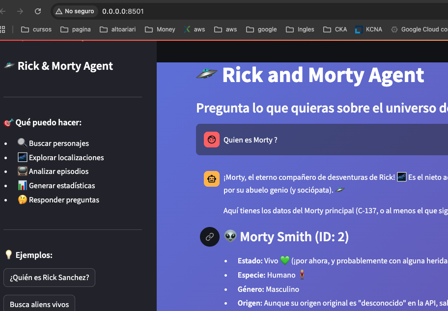

# 🛸 Rick and Morty MCP Lab

## Medium [🛸 Rick and Morty](https://medium.com/@giovannyorjuel2/c%C3%B3mo-construir-un-agente-ai-inteligente-con-mcp-gemini-y-rick-and-morty-api-4a69c1e0e38e?postPublishedType=initial)

> Un agente AI inteligente que usa Gemini 2.5 Flash + MCP para explorar el universo de Rick and Morty

[](https://opensource.org/licenses/MIT)
[](https://www.python.org/downloads/)
[](https://www.docker.com/)




---

## 🎯 ¿Qué es esto?

Un agente AI conversacional que:
- 💬 Hablas en lenguaje natural ("¿Quién es Rick?")
- 🧠 Gemini entiende y decide qué hacer
- 🔧 Usa herramientas MCP para buscar en la API
- ✨ Te responde con información organizada y entretenida

**En 3 palabras:** ChatGPT para Rick & Morty

---

## ⚡ Quick Start

```bash
# 1. Clonar
git clone <tu-repo>
cd rickmorty-mcp-lab

# 2. Configurar API Key de Gemini
cp .env.example .env
nano .env  # Añadir GEMINI_API_KEY

# 3. Iniciar
docker-compose up -d

# 4. Abrir navegador
open http://localhost:8501
```

**Obtener API Key gratuita:** https://makersuite.google.com/app/apikey

---

## 🎨 Demo

### UI Web (Streamlit)
```bash
http://localhost:8501
```
Chat interactivo con historial y botones de ejemplo

### CLI Rápido
```bash
docker-compose exec agent python query.py "¿Quién es Rick Sanchez?"
```

### Terminal Interactivo
```bash
docker-compose exec agent python agent.py
```

---

## 🏗️ Arquitectura

```
Usuario → UI (Streamlit) → Agente (Gemini) → MCP Server → Rick & Morty API
          Puerto 8501      Cerebro IA         Herramientas  Datos
```

**3 componentes principales:**

1. **Agente AI (Gemini 2.5 Flash)**
   - Entiende lenguaje natural
   - Decide qué herramientas usar
   - Formatea respuestas bonitas

2. **MCP Server (FastMCP)**
   - 9 herramientas especializadas
   - Búsqueda de personajes, locaciones, episodios
   - Estadísticas y análisis

3. **UI (Streamlit)**
   - Chat interactivo
   - Botones de ejemplo
   - Verificación de estado

---

## 🎯 Ejemplos de Uso

```
"¿Quién es Rick Sanchez?"
→ Busca y presenta info detallada del personaje

"Busca aliens vivos"
→ Filtra personajes por especie y estado

"¿En qué episodios aparece Evil Morty?"
→ Analiza apariciones y lista episodios

"Dame estadísticas generales"
→ Resumen de personajes, locaciones y episodios

"Compara Rick C-137 con otros Ricks"
→ Búsqueda y análisis comparativo
```

---
